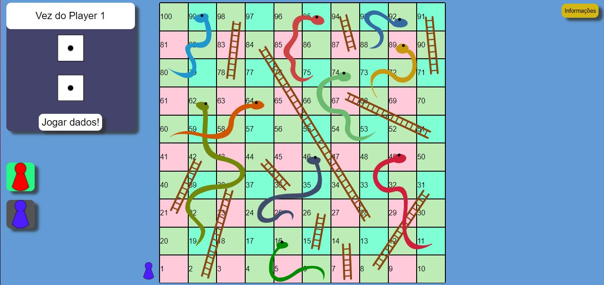
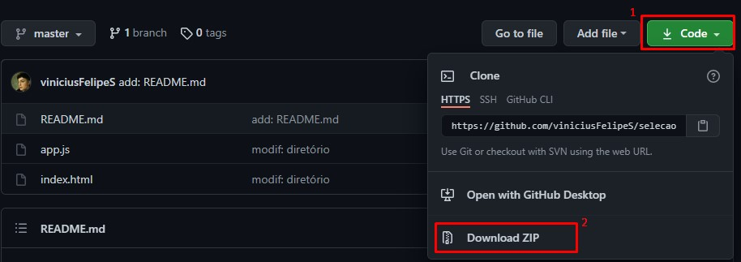

# Seleção de Desenvolvedor de Software - Escribo (TT2)

## :memo: Sobre
Implementar  o jogo Indiano Cobras e Escadas usando JavaScript

## 🖥️ Aparência do site


## 👷 Como rodar

### Clonando repositório
```bash
# Clone o repositório
git clone https://github.com/viniciusFelipeS/selecao-escribo-TT2

#Abra o arquivo index.html localizado na pasta do clone,
#Clique em "Jogar dados!" para iniciar o jogo
#Chame um amigo e se divirta!
```
### Baixando .zip

1. Baixe o .zip como demonstrado na imagem abaixo
2. Extraia o arquivo .zip
3. Abra o arquivo index.html localizado na pasta extraida
4. Clique em "Jogar dados!" para iniciar o jogo
5. Chame um amigo e se divirta!



